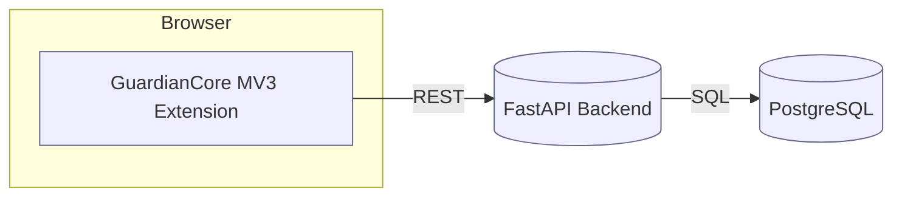
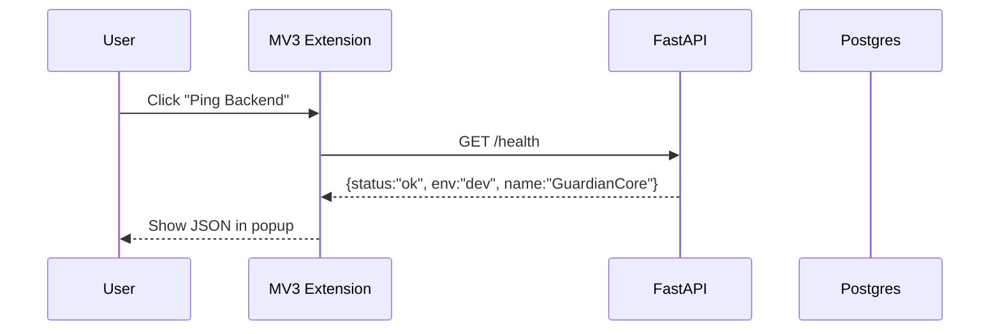
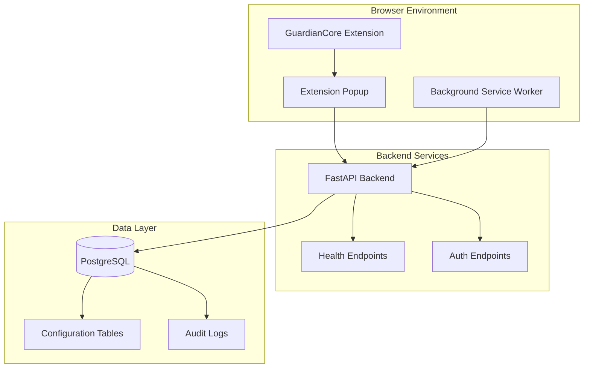
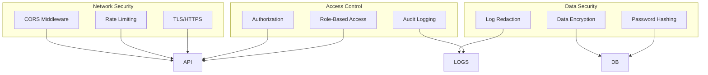

# GuardianCore Architecture

## High-level Architecture

```mermaid
flowchart LR
  subgraph Browser
    EXT[GuardianCore MV3 Extension]
  end

  EXT -- REST --> API[(FastAPI Backend)]
  API -- SQL --> DB[(PostgreSQL)]

  classDef a fill:#eef,stroke:#668;
  class EXT,API,DB a;
```

## Request Lifecycle (Hello World ping)

```mermaid
sequenceDiagram
  participant U as User
  participant Ext as MV3 Extension
  participant API as FastAPI
  participant DB as Postgres

  U->>Ext: Click "Ping Backend"
  Ext->>API: GET /health
  API-->>Ext: {status:"ok", env:"dev", name:"GuardianCore"}
  Ext-->>U: Show JSON in popup
```

## Data Flow Architecture

```mermaid
flowchart TD
  subgraph "Browser Environment"
    EXT[GuardianCore Extension]
    POPUP[Extension Popup]
    BG[Background Service Worker]
  end
  
  subgraph "Backend Services"
    API[FastAPI Backend]
    HEALTH[Health Endpoints]
    AUTH[Auth Endpoints]
  end
  
  subgraph "Data Layer"
    DB[(PostgreSQL)]
    CONFIG[Configuration Tables]
    LOGS[Audit Logs]
  end
  
  EXT --> POPUP
  POPUP --> API
  BG --> API
  API --> HEALTH
  API --> AUTH
  API --> DB
  DB --> CONFIG
  DB --> LOGS
```

## Security Architecture

```mermaid
flowchart TD
  subgraph "Network Security"
    CORS[CORS Middleware]
    RATE[Rate Limiting]
    TLS[TLS/HTTPS]
  end
  
  subgraph "Data Security"
    ENCRYPT[Data Encryption]
    HASH[Password Hashing]
    REDACT[Log Redaction]
  end
  
  subgraph "Access Control"
    AUTHZ[Authorization]
    RBAC[Role-Based Access]
    AUDIT[Audit Logging]
  end
  
  CORS --> API
  RATE --> API
  TLS --> API
  ENCRYPT --> DB
  HASH --> DB
  REDACT --> LOGS
  AUTHZ --> API
  RBAC --> API
  AUDIT --> LOGS
```
